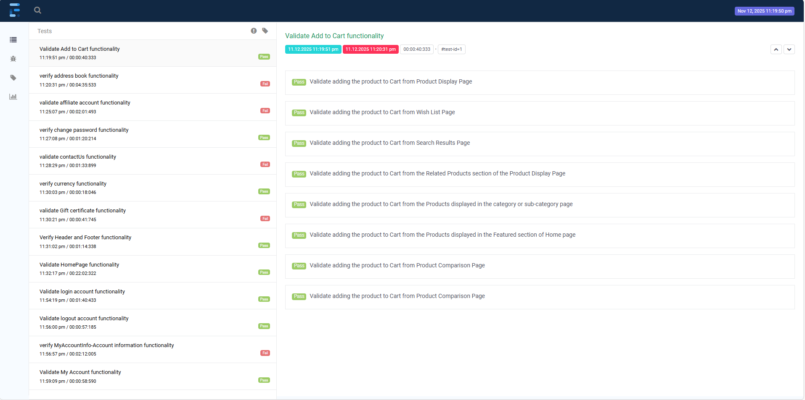
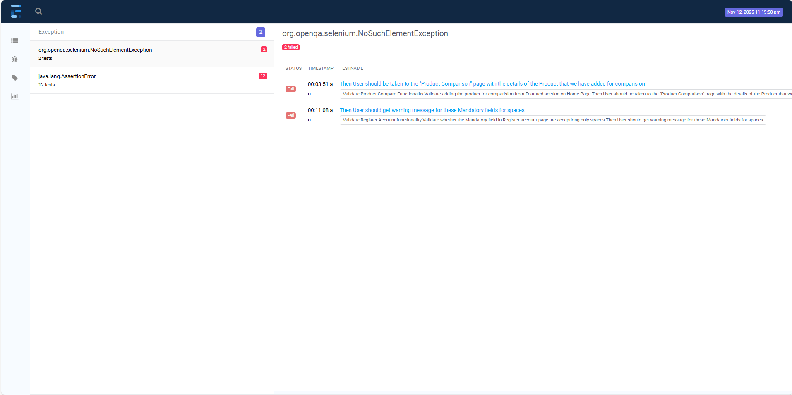
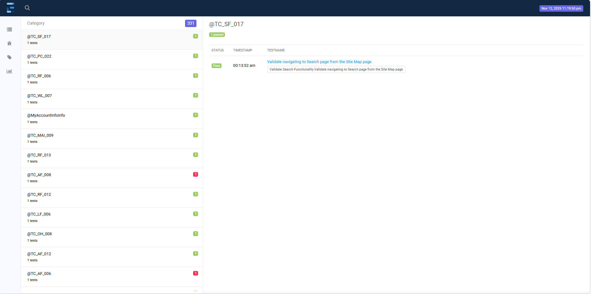
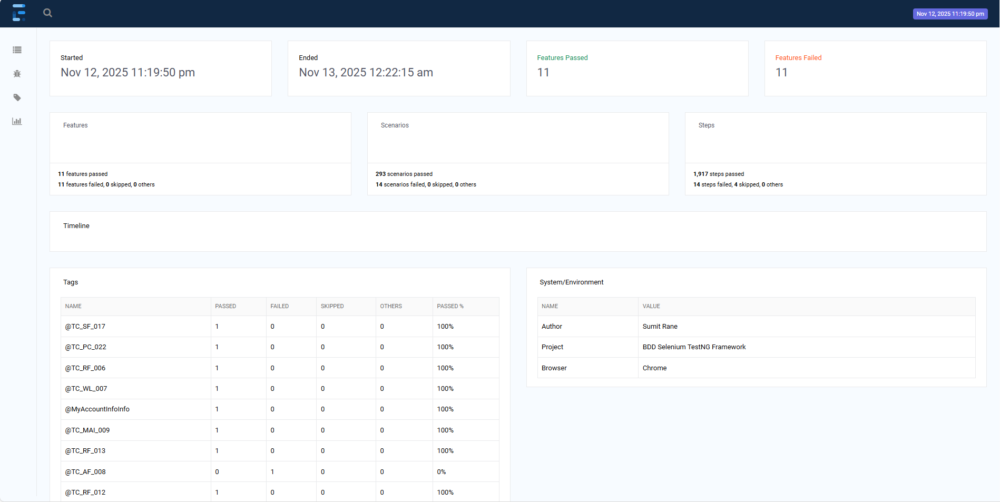
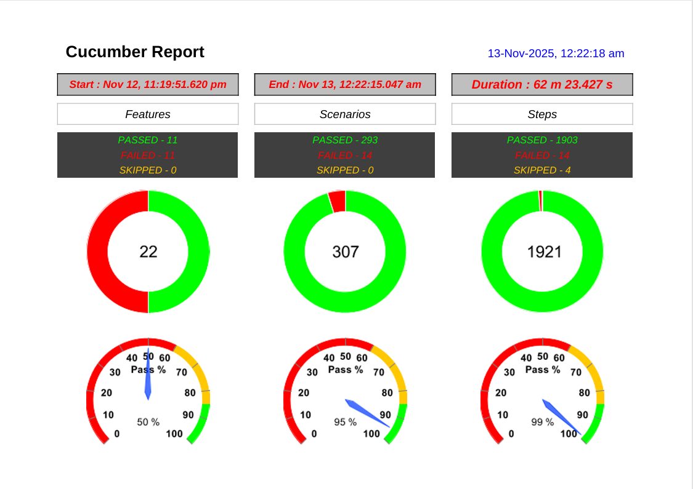
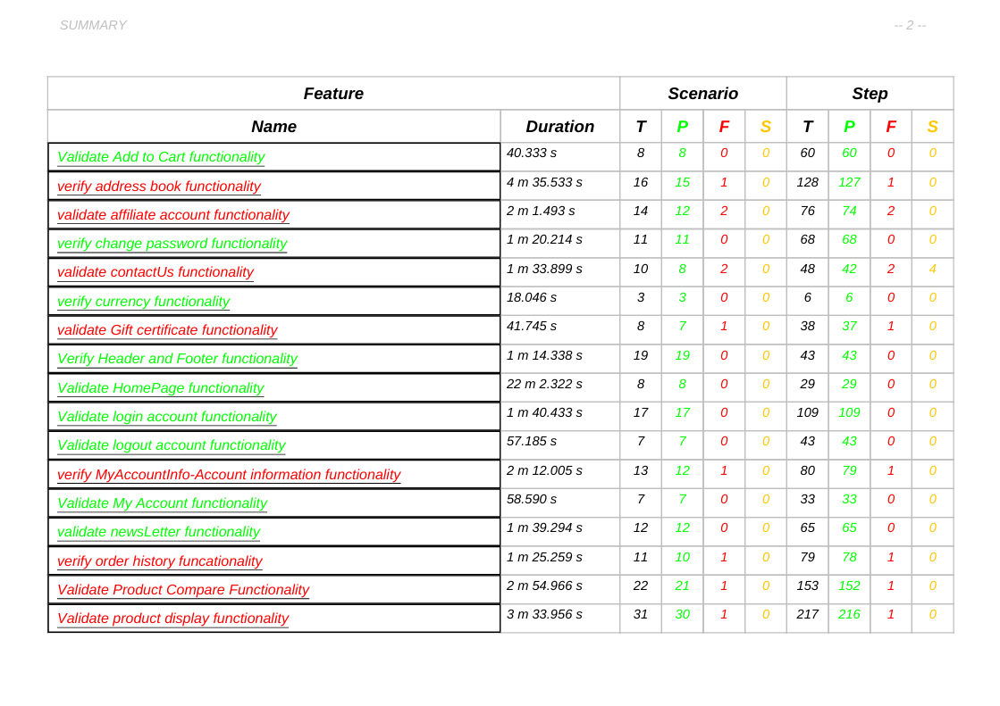
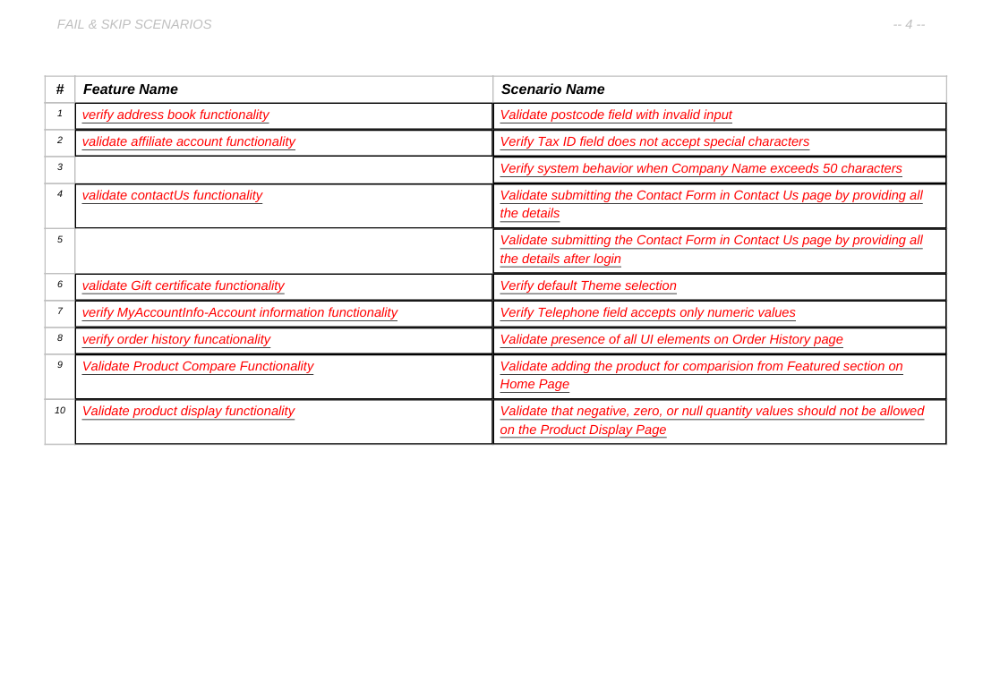
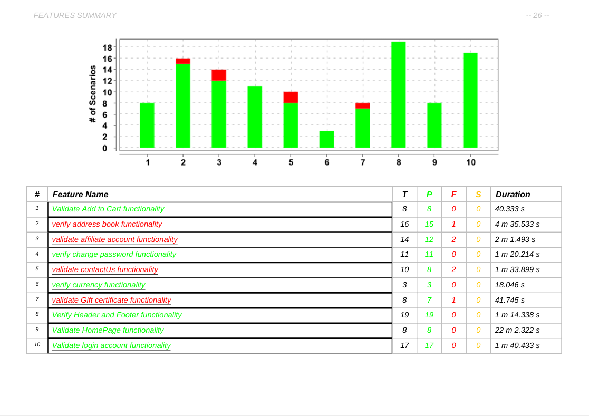
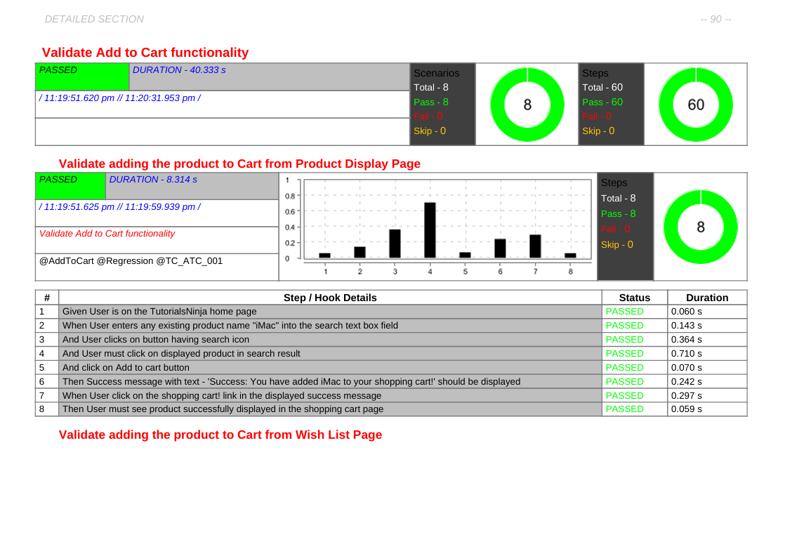
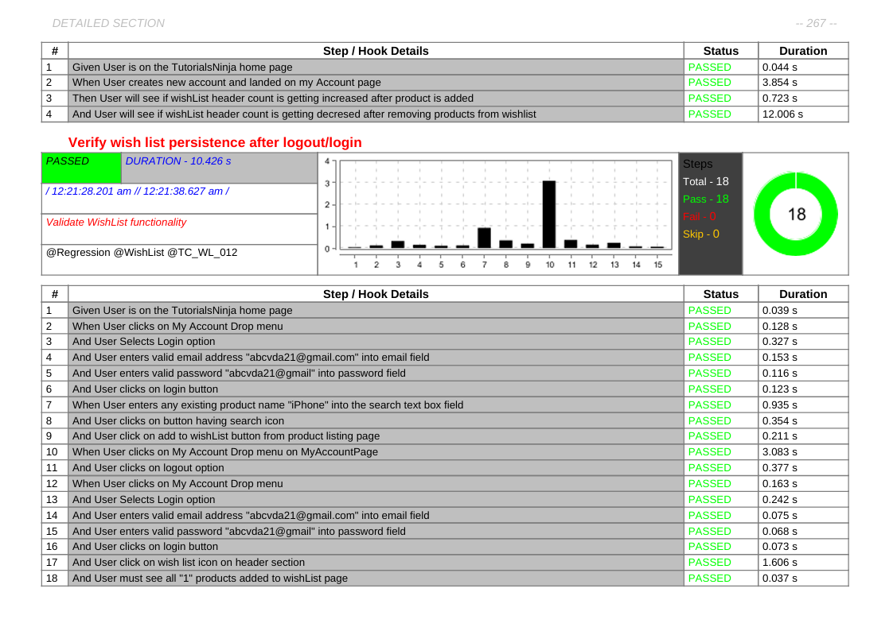

# Cucumber-Selenium-TutorialNinja

Automation Testing Framework for the **Tutorial Ninja E-Commerce Website** using **Cucumber BDD + Selenium + TestNG + Maven**.  
This project demonstrates an end-to-end **hybrid automation framework** covering UI functional testing, data-driven testing, and reporting.

---

## Project Overview

This framework automates the testing of the [Tutorial Ninja Demo Site](https://tutorialsninja.com/demo),  
an e-commerce web application that allows users to register, search for products, add them to cart, and place orders.

The framework is built using a **Behavior Driven Development (BDD)** approach with **Cucumber**,  
following **Page Object Model (POM)** design pattern and **hybrid utilities** for reusability and maintainability.

---

## Framework Architecture

```
Cucumber-Selenium-TutorialNinja/
│
├── src/test/java/
│ ├── features/ # Cucumber feature files
│ ├── pageObjects/ # Page classes for each web page
│ ├── stepDefinitions/ # Step definition classes
│ ├── runners/ # Test runner files
│ ├── testBase/ # Base setup, driver initialization
│ └── utilities/ # Utilities (Excel, Config, Waits, Reports)
│
├── src/test/resources/ # Config files, logs, test data
│ ├── config.properties
│ ├── log4j2.xml
│ └── testdata.xlsx
│
├── reports/ # Extent HTML reports & screenshots
│ ├── ExtentReport.html
│ └── Screenshots/
│
├── documents/ # QA documentation
│ ├── TestPlan_TutorialNinja.pdf
│ ├── RTM_TutorialNinja.xlsx
│ ├── TestClosureReport_TutorialNinja.pdf
│ ├── DefectReport_TutorialNinja.xlsx
│ └── TestCaseSheet_TutorialNinja.xlsx
│
├── pom.xml # Maven dependencies & build config
├── README.md # Project description (this file)
└── .gitignore
```
---

### Tools & Technologies Used

- **Java**  
  Core programming language

- **Selenium WebDriver**  
  Web UI automation

- **Cucumber BDD**  
  Behavior Driven Development framework

- **TestNG**  
  Test execution & assertions

- **Maven**  
  Build and dependency management

- **Extent Reports**  
  HTML test reporting

- **Log4j2**  
  Logging

- **Apache POI**  
  Data-driven testing with Excel

- **Git & GitHub**  
  Version control and repository hosting


---

## Key Framework Features

- **BDD Hybrid Framework** using Cucumber + TestNG + Selenium  
- **Page Object Model (POM)** + **PageFactory** implementation  
- **Data-driven testing** via Excel integration  
- **Config-driven execution** (browser, URL, credentials)  
- **Extent Reports** with screenshots for failed steps  
- **Reusable utilities** (Waits, ConfigReader, ExcelUtils, etc.)  
- **Parallel execution ready** via TestNG  
- **CI/CD Integration ready** (can be linked with Jenkins)

---

## Test Scenarios Automated

1. User Registration and Login  
2. Product Search and Navigation  
3. Add to Cart, Update, and Remove Product  
4. Checkout Process and Order Confirmation  
5. Order History Verification  
6. Negative Scenarios (invalid credentials, empty cart, etc.)  
7. UI and Regression Testing

---

## How to Execute Tests

### **Pre-requisites**
- Install Java JDK (>= 11)
- Install Maven
- Configure environment variables for `JAVA_HOME` and `MAVEN_HOME`
- Install IDE (IntelliJ / Eclipse)
- Clone the repository

##### **Execution Steps**

##### Clone the repository
git clone https://github.com/sumitrane198/Cucumber-Selenium-TutorialNinja.git

##### Navigate to project library
cd Cucumber-Selenium-TutorialNinja

##### Execute tests using Maven
mvn clean test

##### View the report
After execution, open:
reports/ExtentReport.html

##### Test Reports
Detailed HTML report generated via Extent Reports
Captures:
Step logs (Given/When/Then)
Screenshots for failures
Execution time and summary

### Sample Test Execution Screenshots
Test Cases Execution:

Test Cases steps Failed:

Test Cases Category - tags:

Test Cases Logs :


Sample PDF TestExecution report:







### QA Documentation

All testing documentation related to the project is included under the `/documents` folder:

- **Test Plan**  
  Defines scope, strategy, objectives, and approach.

- **RTM (Requirement Traceability Matrix)**  
  Maps requirements to test cases.

- **Test Case Sheet**  
  Contains manual + automated test scenarios.

- **Defect Report**  
  Logged defects with status and severity.

- **Test Closure Report**  
  Summary of testing completion and metrics.

### Framework Highlights

- ✅ Designed using Cucumber + TestNG integration  
- ✅ Implemented PageFactory for page element management  
- ✅ Included ConfigReader for environment management  
- ✅ Added ExcelUtils for data-driven scenarios  
- ✅ Integrated Extent Report with screenshots  
- ✅ Configured Hooks for pre/post test steps  
- ✅ Organized Runners for scenario grouping  


###Sample Maven Dependencies (pom.xml)
<dependencies>
    <!-- Selenium -->
    <dependency>
        <groupId>org.seleniumhq.selenium</groupId>
        <artifactId>selenium-java</artifactId>
        <version>4.21.0</version>
    </dependency>

    <!-- Cucumber -->
    <dependency>
        <groupId>io.cucumber</groupId>
        <artifactId>cucumber-java</artifactId>
        <version>7.18.1</version>
    </dependency>
    <dependency>
        <groupId>io.cucumber</groupId>
        <artifactId>cucumber-testng</artifactId>
        <version>7.18.1</version>
    </dependency>

    <!-- TestNG -->
    <dependency>
        <groupId>org.testng</groupId>
        <artifactId>testng</artifactId>
        <version>7.11.0</version>
        <scope>test</scope>
    </dependency>

    <!-- Extent Reports -->
    <dependency>
        <groupId>com.aventstack</groupId>
        <artifactId>extentreports</artifactId>
        <version>5.0.9</version>
    </dependency>

    <!-- Apache POI for Excel -->
    <dependency>
        <groupId>org.apache.poi</groupId>
        <artifactId>poi-ooxml</artifactId>
        <version>5.2.5</version>
    </dependency>
</dependencies>

### Utilities Implemented

- **ConfigReader.java**  
  Reads properties from the configuration file.

- **WaitUtils.java**  
  Manages explicit and fluent waits for WebElements.

- **ExcelUtils.java**  
  Supports data-driven testing using Excel files.

- **ScreenshotUtils.java**  
  Captures screenshots for reports and failed test cases.

- **ExtentReportManager.java**  
  Handles HTML report creation and logging for test results.


### Reports & Screenshots

- Reports are generated in: `/reports/ExtentReport.html`  
- Failed test screenshots are stored in: `/reports/Screenshots/`

**Sample Structure:**

```
reports/
├── ExtentReport.html
└── Screenshots/
    ├── LoginFailure_01.png
    └── CheckoutError_02.png
```


### 👨‍💻 Author

**Sumit Rane**  
*Test Analyst | Automation QA Engineer*  
📍 Pune, Maharashtra, India  
📧 [sumitrane198@gmail.com](mailto:sumitrane198@gmail.com)

---

⭐ *If you find this project useful, don’t forget to star the repository!*
